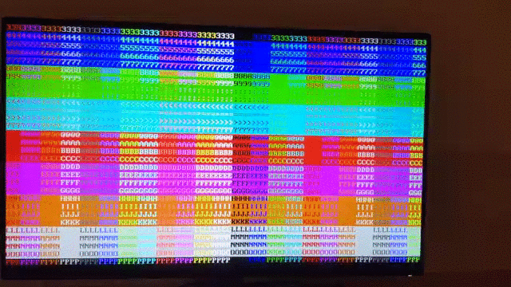

# verilog-hdmi

SystemVerilog code for FPGA HDMI 1.4a video/audio output, along with utility code like VGA-compatible text mode.

## Why?

Most open source HDMI modules output a DVI signal, which HDMI sinks are backwards compatible with.

To send audio and other auxiliary data, a true HDMI signal must be sent. The HDMI module in this repository lets you do that.

### Demo: VGA-compatible text mode, 720x480p on a Dell Ultrasharp 1080p Monitor

## Usage

* Take HDMI modules from `modules/hdmi` and add them to your own project.
* Other helpful modules for displaying text / generating sound are also available in `modules/`.
* Consult `top/max10/max10_top.v` for an example of usage.
* Please create an issue if you run into any problems

### Pixel/TMDS Clock

You'll need to set up a PLL for producing the HDMI clocks. The pixel clock for each supported format is shown below:

|Video Resolution|Video ID Code(s)|Refresh Rate|Pixel Clock Frequency|
|---|---|---|---|
|640x480|1|60Hz|25.2MHz|
|640x480|1|59.94Hz|25.175MHz|
|720x480|2, 3|60Hz|27.027MHz|
|720x480|2, 3|59.94Hz|27MHz|
|1280x720|4|60Hz|74.25MHz|
|1280x720|4|59.94Hz|74.176MHz|
|1920x1080|16|60Hz|148.5MHz|
|1920x1080|16|59.94Hz|148.352MHz|
|720x576|17, 18|50Hz|27MHz|
|1280x720|19|50Hz|74.25MHz|

The TMDS clock should be 10 times as fast as the pixel clock.  If you only have 1 PLL, you can try to set up the TMDS clock and pulse the pixel clock at 1/10th the speed.

## L-PCM Audio Bitrate / Sampling Frequency

Both bitrate and frequency are specified as parameters of the HDMI module. Bitrate can be any value from 16 through 24. Below is a simple mapping of sample frequency to the appropriate parameter

|Sampling Frequency|AUDIO_RATE value|
|---|---|
|32 kHz|32|
|44.1 kHz|44.1|
|88.2 kHz|88.2|
|176.4 kHz|176.4|
|48 kHz|48|
|96 kHz|96|
|192 kHz|192|

## Potential limitations

* Resolution: some FPGAs don't support I/O at speeds high enough to achieve 720p/1080p
	* Workaround: use DDR/other special I/O features
* LVDS/TMDS: if your FPGA doesn't support TMDS, you should be able to use LVDS instead (tested up to 720x480)
    * Needs further investigation
* Wiring: if you're using a breakout board or long lengths of untwisted wire, there might be a few pixels that jitter due to interference. Make sure you have all the necessary pins connected. Sometimes disconnecting the ground pins might actually reduce interference.
* Hot-Plug Unaware: all modules are unaware of hotplug. This shouldn't affect anything in the long term -- the only stateful value is hdmi.tmds_channel.acc. The user should decide what behavior is appropriate on connect/disconnect.
* EDID not implemented: it is assumed you know what format you want at synthesis time, so there is no dynamic decision on video format.

### To-do List
- [x] 24-bit color
- [x] Data island packets
	- [x] Null packet
	- [x] ECC with BCH systematic encoding GF(2^8)
	- [x] Audio clock regeneration
	- [x] L-PCM audio
		- [x] 2-channel
		- [ ] 3-channel to 8-channel
	- [ ] 1-bit audio
	- [x] Audio InfoFrame
	- [x] Auxiliary Video Information InfoFrame
- [x] Video formats 1, 2, 3, 4, 16, 17, 18, and 19
- [x] VGA-compatible text mode
	- [x] IBM 8x16 font
	- [ ] Alternate fonts
- [ ] Other color formats (YCbCr, 32-bit color, etc.)
- [ ] Support other video id codes
	- [ ] Interlaced video
	- [ ] Pixel repetition

### Licensing

Dual-licensed under Apache License 2.0 and MIT License.

## Reference Documents

*These documents are not hosted here! They are available on Library Genesis and at other locations.*

* [HDMI Specification v1.4a](https://libgen.is/book/index.php?md5=28FFF92120C7A2C88F91727004DA71ED)
* [EIA-CEA861-D.pdf](https://libgen.is/book/index.php?md5=CEE424CA0F098096B6B4EC32C32F80AA)
* [DVI Specification v1.0](https://www.cs.unc.edu/~stc/FAQs/Video/dvi_spec-V1_0.pdf)
* [IEC 60958-1](https://ia803003.us.archive.org/30/items/gov.in.is.iec.60958.1.2004/is.iec.60958.1.2004.pdf)
* [IEC 60958-3](https://ia800905.us.archive.org/22/items/gov.in.is.iec.60958.3.2003/is.iec.60958.3.2003.pdf)

## Special Thanks

* Mike Field's (@hamsternz) demos of DVI and HDMI output for helping me better understand HDMI
	* http://www.hamsterworks.co.nz/mediawiki/index.php/Dvid_test
	* http://www.hamsterworks.co.nz/mediawiki/index.php/Minimal_DVI-D
* Jean P. Nicolle (fpga4fun.com) for sparking my interest in HDMI
	* https://www.fpga4fun.com/HDMI.html
* Bureau of Indian Standards for free equivalents of non-free IEC standards 60958-1, 60958-3, etc.
